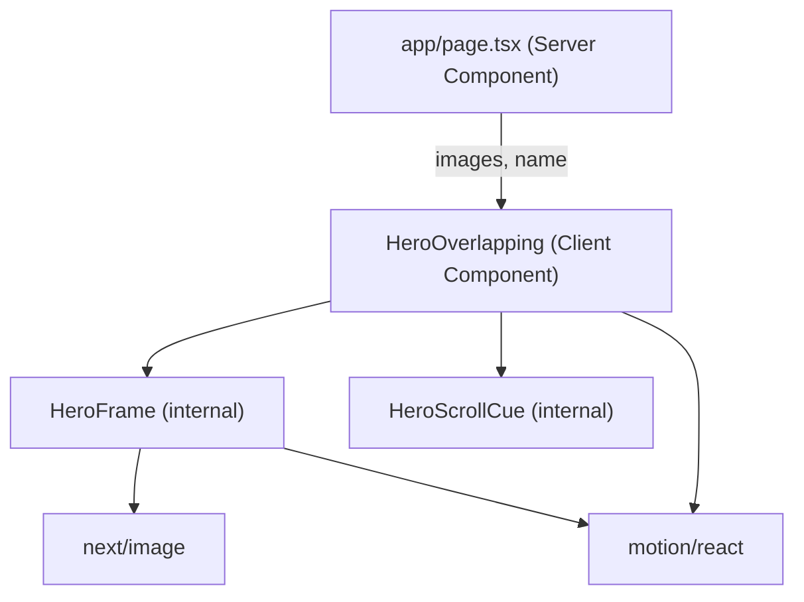

# System Design & Architecture

## Architecture Overview

Pure frontend component — no API, no CMS, no state beyond local motion values. The new `HeroOverlapping` component replaces the existing `Hero` on the homepage. All data flows in via props from the server-component page.



The component is a client component (`'use client'`) because it uses `useScroll`, `useMotionValue`, and `useSpring` from `motion/react`.

## Data Models

**Props interface (HeroOverlapping):**
```ts
interface HeroOverlappingProps {
  /** The photographer's name. Surname is rendered in italic accent colour. */
  name: string;
  /**
   * Pool of portfolio images to randomise from.
   * The component picks 3 unique images on client mount — different every page load.
   * Must contain at least 3 items.
   */
  imagePool: ImageType[];
}
```

`ImageType` is imported from `@/components/types` (existing shared type).

**Internal state:**
```ts
// Picked once on mount via useState lazy initialiser
const [frames] = useState<[ImageType, ImageType, ImageType]>(() => pickThree(imagePool));
// frames[0] = back, frames[1] = front, frames[2] = accent
```

`pickThree` is a pure utility (Fisher-Yates or simple sort shuffle) defined at the top of the file — not exported.

No data model changes required to existing JSON files — the homepage page component passes the combined pool from `src/data/*.json` arrays.

## Component Breakdown

### `HeroOverlapping` (client component)
- Root `<section>` — full viewport height, warm background, `overflow-hidden`
- Wires up `useScroll` for scroll parallax and `useMotionValue` + `useSpring` for mouse parallax
- Renders three `HeroFrame` instances with different layout/speed configs
- Renders name text block and accent underline at bottom-left
- Renders `HeroScrollCue` at bottom-right

### `HeroFrame` (internal, not exported)
- `motion.div` wrapper with absolute positioning and box-shadow
- `next/image` with `fill` and fade-in entrance via `initial/animate`
- Accepts: `image`, `className` (for size/position), `motionStyle` (scroll + mouse parallax transforms), `enterDelay`
- Thin decorative inset border via `::before`-equivalent inner div

### Name text block (inline in HeroOverlapping)
- `<h1>` with serif font (`font-display`) — first name plain, surname wrapped in `<em>` styled with accent color
- `motion.div` for `translateY` + `opacity` entrance
- Accent underline: `motion.div` animated `width` from `0` to `40px`

### `HeroScrollCue` (internal, not exported)
- Fixed-position bottom-right within the hero `relative` container
- "Scroll" label + animated vertical line (pulse loop)
- Fades out as user scrolls past the hero (via `useTransform` on scroll progress)

## Design Decisions

| Decision | Choice | Rationale |
|---|---|---|
| Random image selection | `useState` lazy initialiser on mount | Homepage is statically generated — server-side `Math.random()` would be fixed at build time. Client mount guarantees a new random pick on every page load. |
| Mouse parallax approach | `useMotionValue` + `useSpring` (stiffness ~80, damping ~20) | Smooth lerp without a manual RAF loop; cleaner than the vanilla JS in the reference |
| Scroll parallax | `useScroll` + `useTransform` per frame | Declarative, performant, integrates with motion's transform pipeline |
| Image loading fade | `initial={{ opacity: 0 }} animate={{ opacity: 1 }}` on each frame | Matches reference `.frame img.loaded` pattern; avoids layout shift |
| Reduced motion | `useReducedMotion()` — skip all `initial` states and parallax offsets | Matches existing `HeroContent` pattern in the codebase |
| Accent frame on mobile | Hidden below `md` breakpoint | Three frames are cramped at 375px; two frames retain the compositional intent |
| Tagline + specialties | Removed | Not present in the reference design; cleaner, more minimal |

## Non-Functional Requirements

- **Performance:** Three `next/image` components with `priority` on the front frame, lazy on back and accent. Parallax updates via motion's optimised transform pipeline (no layout thrash).
- **Accessibility:** `<section>` with implicit landmark role. Images have descriptive `alt` text. Heading hierarchy: `<h1>` for the name. No interactive elements inside the frames.
- **Responsive:** No horizontal overflow at any viewport. Accent frame hidden on mobile (`hidden md:block`).
- **Animation safety:** All motion gated on `!shouldAnimate` from `useReducedMotion()`.
