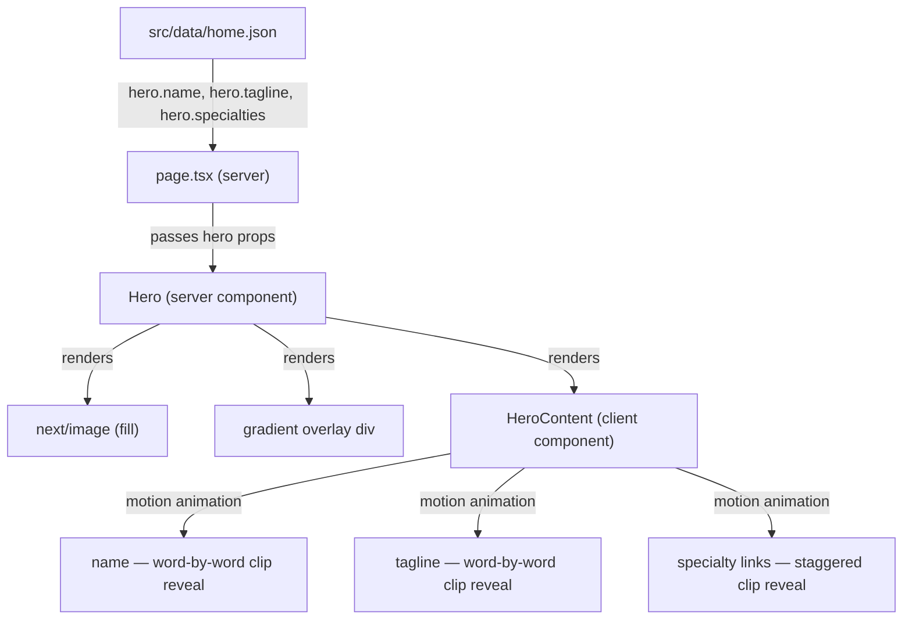

# System Design & Architecture

## Architecture Overview

The `Hero` server component renders the image and gradient. A new `HeroContent` **client component** handles all animation. This keeps the `'use client'` boundary as small as possible — only the overlay crosses it.



**New dependency:** `motion` (motion.dev) — `pnpm add motion`

## Data Models

### Updated `home.json` — `hero` object

```json
{
  "hero": {
    "image": {
      "src": "/images/food/70.jpg",
      "alt": "Neil Hurley Photography"
    },
    "name": "Neil Hurley",
    "tagline": "Commercial photographer based in Dublin",
    "specialties": [
      { "label": "Food & Drink", "href": "/food" },
      { "label": "Advertising & Product", "href": "/advertising" }
    ]
  }
}
```

### Updated `HeroProps` interface

```ts
import type { ImageType, LinkType } from '@/components/types';

interface HeroProps {
  /** Hero background image. */
  image: ImageType;
  /** Photographer name displayed in the overlay. */
  name: string;
  /** Short positioning tagline. */
  tagline: string;
  /** Specialty area labels with hrefs, rendered as navigation links. */
  specialties: LinkType[];
}
```

`HeroContent` accepts the same props minus `image`.

## Component Breakdown

### `Hero` (`src/components/hero/hero.tsx`) — server component

- Unchanged image + gradient rendering
- Renders `<HeroContent name tagline specialties />` as a child

### `HeroContent` (`src/components/hero/hero-content.tsx`) — client component

Handles all Motion animation. Key technique: **clip-path word reveal**.

Each word is wrapped in two `<span>` layers:
- **Outer span:** `display: inline-block; overflow: hidden` — acts as the clip mask
- **Inner span:** animated from `translateY(110%)` → `translateY(0)` — the word slides up from behind the clip edge

The result is words appearing to emerge from an invisible baseline, like a typographic curtain lift. This is more precise than a `clip-path` on the container itself because each word animates independently.

**Stagger sequence:**
1. Name words — stagger 60ms apart, 500ms duration, `easeOut` curve
2. Tagline words — begin after name completes + 100ms delay, stagger 40ms, 400ms duration
3. Specialty labels — begin after tagline + 80ms delay, stagger 80ms, slide up + `clip-path: inset(0 0 100% 0)` → `inset(0 0 0% 0)`

### `src/data/home.json`

- `hero` object extended with `name`, `tagline`, `specialties`

### `src/app/page.tsx`

- Pass `homeData.hero.name`, `homeData.hero.tagline`, `homeData.hero.specialties` into `<Hero>`

## Design Decisions

| Decision | Choice | Rationale |
|---|---|---|
| Text position | Bottom-left | Editorial photography convention; keeps subject unobscured |
| `HeroContent` split | Thin client wrapper | Keeps server/client boundary explicit; Hero image SSR unaffected |
| Animation technique | Per-word `translateY` inside `overflow:hidden` parent | Cleaner than container `clip-path`; each word is independently controllable |
| Specialty labels | `clip-path: inset(0 0 100% 0)` → `inset(0 0 0% 0)` | Wipe-up reveal suits the pill/label shape; distinct from name technique |
| `useReducedMotion` | `motion` built-in hook — skip animation if true | Respects OS preference; no animation flicker on first paint |
| Name element | `<p>` styled large | Page has a visually hidden `<h1>` for a11y; name is presentational |
| Links | `next/link` `<Link>` inside `motion.li` | Motion wraps the `<li>`, `<Link>` handles navigation |

## Non-Functional Requirements

- **Accessibility:** Text must meet WCAG AA contrast. `useReducedMotion` skips all animation. The animated elements still render in full at rest state for users who prefer no motion.
- **Performance:** Motion is tree-shaken. Only `motion`, `useAnimate`, and `useReducedMotion` are imported. No additional network requests.
- **Responsive:** Font sizes scale — name `text-3xl md:text-5xl`, tagline `text-sm md:text-base`. Labels wrap gracefully at 375px.
- **SSR / hydration:** `HeroContent` renders with `'use client'`. Motion handles hydration cleanly — content is in DOM immediately, animation plays after mount. No layout shift.
